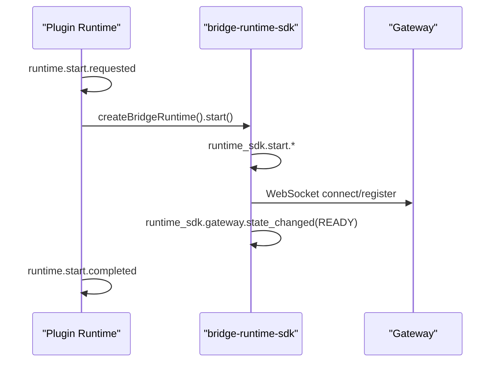
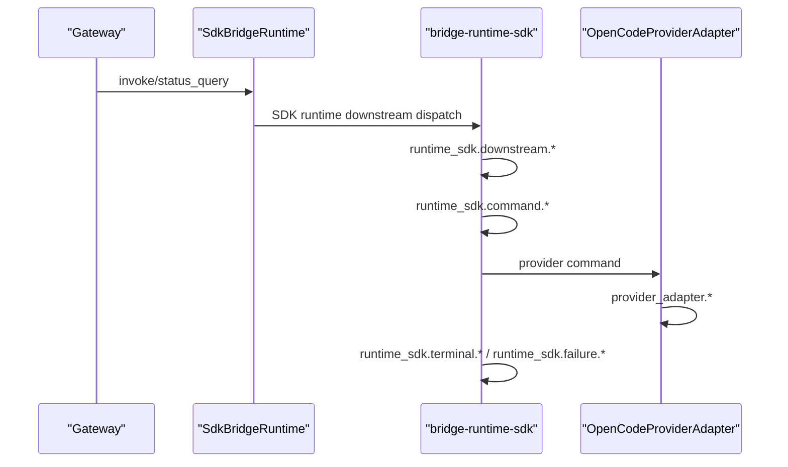
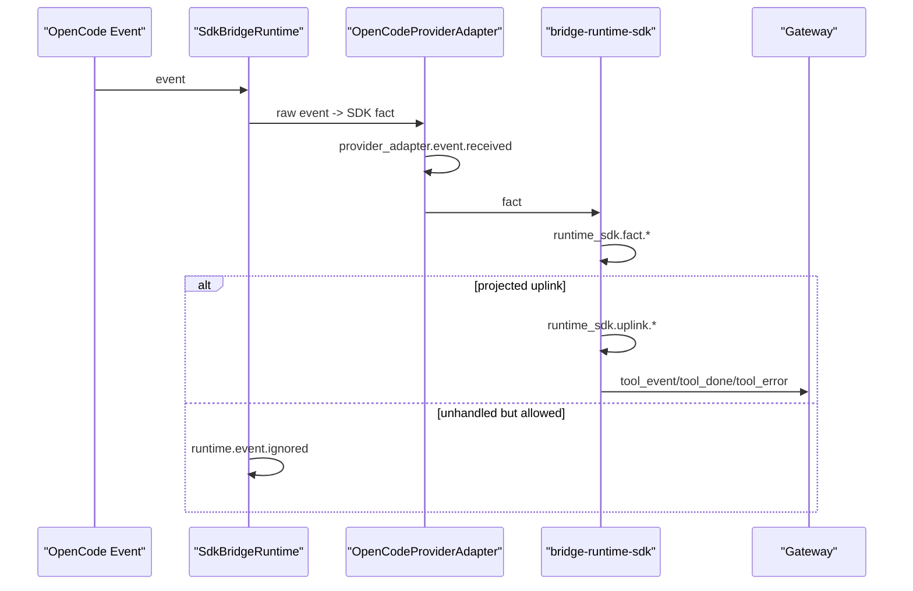
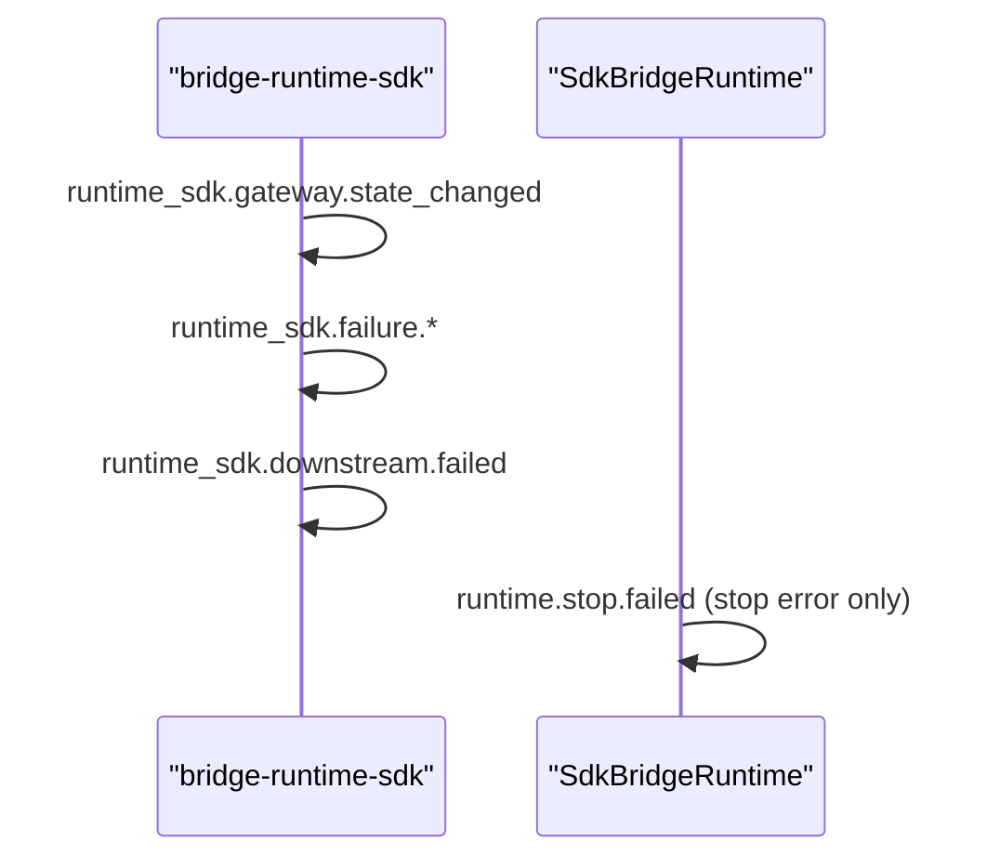

# message-bridge 日志可观测性手册

**Version:** 1.0  
**Date:** 2026-03-07  
**Status:** Active  
**Owner:** message-bridge maintainers  
**Related:** `../../README.md`, `../README.md`, `../../src/runtime/AppLogger.ts`

## 1. 日志总览

- 上报通道：OpenCode 插件注入客户端 `input.client.app.log()`
- 固定服务名：`service=message-bridge`
- 日志级别：
  - `debug`：调试细节、链路状态、低风险诊断信息
  - `info`：关键生命周期与正常完成路径
  - `warn`：可恢复异常、前置条件不满足、降级路径
  - `error`：执行失败、异常、需要重点排查的问题
- 失败策略：日志上报失败不阻断业务链路（best effort）

补充说明：

- `debug` 默认关闭
- `config.env.snapshot` 固定使用 `info` 级输出，不受 `debug` 开关影响
- 当 `debug=true` 时，连接层会额外输出原始 WebSocket 报文
- 这些原始报文日志固定使用 `info` 级别，避免依赖宿主 `debug` 级过滤后丢失

## 2. 字段字典

`client.app.log()` 请求体（`body`）：

| 字段 | 类型 | 说明 |
|---|---|---|
| `service` | `string` | 固定为 `message-bridge` |
| `level` | `'debug' \| 'info' \| 'warn' \| 'error'` | 日志级别 |
| `message` | `string` | 事件名（如 `gateway.ready`） |
| `extra` | `Record<string, unknown>` | 链路上下文（敏感字段已脱敏） |

`extra` 生成规则（`src/runtime/AppLogger.ts`）：

| 场景 | 行为 |
|---|---|
| 默认（`BRIDGE_DEBUG` 未开启） | 输出脱敏后的完整字段 |
| `BRIDGE_DEBUG=true` | 不改变 `extra` 内容；除了 fallback / send-failed 的 `console.debug` 提示外，还会在连接层额外输出 `info` 级原始 WebSocket 报文 |
| 脱敏键 | key 包含 `ak/sk/token/authorization/cookie/secret/password` 时值替换为 `***` |
| 无 `client.app.log` 能力 | 不抛错；仅在 `BRIDGE_DEBUG=true` 时 `console.debug` 提示 `log-fallback` |
| `client.app.log` 抛错 | 吞错不影响主流程；仅在 `BRIDGE_DEBUG=true` 时 `console.debug` 提示 `log-send-failed` |

常见上下文字段（按链路出现）：

| 字段 | 说明 |
|---|---|
| `traceId` | 消息级追踪 ID；上行优先取 `bridgeMessageId`，下行优先取 `gatewayMessageId`，无消息上下文时退化为 runtime 级 ID |
| `runtimeTraceId` | 同一 `AppLogger` 生命周期内稳定不变的 runtime 级追踪 ID |
| `component` | 组件标识（如 `runtime`/`gateway`/`singleton`） |
| `state` | 连接状态（`DISCONNECTED/CONNECTING/CONNECTED/READY`） |
| `errorDetail` | 统一错误提取后的明细消息 |
| `errorName` | 底层错误名（如 `Error`/`TypeError`） |
| `sourceErrorCode` | 底层错误对象里的 `code` 字段 |
| `errorType` | 错误或事件类型（如 `Error` / `error`） |
| `sessionId` | 会话 ID（若可提取） |
| `toolSessionId` | OpenCode / SDK 侧 session ID |
| `agentId` | agent 标识，重连后可能重新绑定 |
| `action` | 下行调用动作名（chat/create_session/...） |
| `eventType` | OpenCode 事件类型 |
| `bridgeMessageId` | bridge 侧生成的消息追踪 ID；主要用于内部发送上下文，日志中通常直接复用到 `traceId`，不再单独输出 |
| `gatewayMessageId` | gateway 下行消息携带或运行时派生的消息 ID |
| `opencodeMessageId` | OpenCode 事件 message ID |
| `opencodePartId` | OpenCode 事件 part ID |
| `payloadBytes` | 出站 JSON 消息 UTF-8 字节数 |
| `frameBytes` | 入站 WebSocket 帧 UTF-8 字节数 |
| `deltaBytes` | 事件 delta 字段 UTF-8 字节数 |
| `diffCount` | `session.diff` 中 diff 项数量 |
| `latencyMs` | 单次动作耗时 |
| `attempt`/`delayMs` | 重连次数与实际重连延迟 |

## 3. 关键路径时序图（Mermaid）

### 3.1 连接建立链路

```mermaid
sequenceDiagram
  participant P as "Plugin Runtime"
  participant S as "bridge-runtime-sdk"
  participant GW as "Gateway"

  P->>P: runtime.start.requested
  P->>S: createBridgeRuntime().start()
  S->>S: runtime_sdk.start.*
  S->>GW: WebSocket connect/register
  S->>S: runtime_sdk.gateway.state_changed(READY)
  P->>P: runtime.start.completed
```

### 3.2 下行 invoke 执行链路

```mermaid
sequenceDiagram
  participant GW as "Gateway"
  participant P as "SdkBridgeRuntime"
  participant S as "bridge-runtime-sdk"
  participant A as "OpenCodeProviderAdapter"

  GW->>P: invoke/status_query
  P->>S: SDK runtime downstream dispatch
  S->>S: runtime_sdk.downstream.*
  S->>S: runtime_sdk.command.*
  S->>A: provider command
  A->>A: provider_adapter.*
  S->>S: runtime_sdk.terminal.* / runtime_sdk.failure.*
```

### 3.3 上行 event 链路

```mermaid
sequenceDiagram
  participant O as "OpenCode Event"
  participant P as "SdkBridgeRuntime"
  participant A as "OpenCodeProviderAdapter"
  participant S as "bridge-runtime-sdk"
  participant GW as "Gateway"

  O->>P: event
  P->>A: raw event -> SDK fact
  A->>A: provider_adapter.event.received
  A->>S: fact
  S->>S: runtime_sdk.fact.*
  alt projected uplink
    S->>S: runtime_sdk.uplink.*
    S->>GW: tool_event/tool_done/tool_error
  else unhandled but allowed
    P->>P: runtime.event.ignored
  end
```

### 3.4 异常恢复链路

```mermaid
sequenceDiagram
  participant S as "bridge-runtime-sdk"
  participant P as "SdkBridgeRuntime"

  S->>S: runtime_sdk.gateway.state_changed
  S->>S: runtime_sdk.failure.*
  S->>S: runtime_sdk.downstream.failed
  P->>P: runtime.stop.failed (stop error only)
```

## 4. 全事件清单（按前缀分组）

说明：同名事件可能在不同组件出现，排障时请优先看“源码位置”区分来源。

### 4.1 runtime.*

| message | level | 触发时机 | 关键 extra | 源码位置 |
|---|---|---|---|---|
| `runtime.start.requested` | info | runtime 启动入口 | `workspacePath` | `src/runtime/SdkBridgeRuntime.ts` |
| `runtime.config.loading_failed` | error | 配置加载失败 | `error`,`workspacePath` | `src/runtime/SdkBridgeRuntime.ts` |
| `runtime.start.completed` | info | SDK runtime 启动完成 | `runtimeMode`,`effectiveDirectory` | `src/runtime/SdkBridgeRuntime.ts` |
| `runtime.stop.failed` | error | SDK runtime stop 抛错 | `error`,`errorDetail`,`errorName`,`sourceErrorCode?` | `src/runtime/SdkBridgeRuntime.ts` |
| `runtime.stop.completed` | info | stop 完成 | `runtimeMode` | `src/runtime/SdkBridgeRuntime.ts` |
| `runtime.event.ignored` | debug | provider 未消费但 allowlist 允许的事件被主链忽略 | `eventType`,`reason` | `src/runtime/SdkBridgeRuntime.ts` |
| `runtime.singleton.reuse_existing` | debug | 复用已存在 runtime | - | `src/runtime/singleton.ts:13` |
| `runtime.singleton.await_initializing` | debug | 等待初始化中的 runtime | - | `src/runtime/singleton.ts:18` |
| `runtime.singleton.initialization_cancelled` | warn | 初始化过程被取消 | - | `src/runtime/singleton.ts:34` |
| `runtime.singleton.initialized` | info | singleton 初始化完成 | `runtimeMode=sdk` | `src/runtime/singleton.ts:38` |
| `runtime.singleton.initialization_failed` | error | singleton 初始化失败 | `error`,`errorDetail`,`errorName`,`sourceErrorCode?` | `src/runtime/singleton.ts:43` |

### 4.2 runtime_sdk.*

| message | level | 触发时机 | 关键 extra | 源码位置 |
|---|---|---|---|---|
| `runtime_sdk.start.*` | info/error | SDK runtime 生命周期启动阶段 | `failureReason`,`code` | `packages/bridge-runtime-sdk/src/adapters/observation/runtime-logger-observation.ts` |
| `runtime_sdk.stop.*` | info/error | SDK runtime 生命周期停止阶段 | `failureReason`,`code` | `packages/bridge-runtime-sdk/src/adapters/observation/runtime-logger-observation.ts` |
| `runtime_sdk.gateway.state_changed` | info | gateway 连接状态变化 | `gatewayState` | `packages/bridge-runtime-sdk/src/adapters/observation/runtime-logger-observation.ts` |
| `runtime_sdk.downstream.*` | info/warn/error | 下行消息校验、分发与失败 | `messageType`,`command`,`toolSessionId`,`welinkSessionId`,`error`,`code` | `packages/bridge-runtime-sdk/src/adapters/observation/runtime-logger-observation.ts` |
| `runtime_sdk.command.*` | info/error | runtime command 派发与完成 | `traceId`,`command`,`toolSessionId`,`welinkSessionId`,`error`,`code` | `packages/bridge-runtime-sdk/src/adapters/observation/runtime-logger-observation.ts` |
| `runtime_sdk.usecase.*` | info/warn/error | SDK usecase 执行阶段 | `traceId`,`toolSessionId`,`welinkSessionId`,`runId`,`outcome`,`error`,`code` | `packages/bridge-runtime-sdk/src/adapters/observation/runtime-logger-observation.ts` |
| `runtime_sdk.provider.*` | debug/info/error | provider 调用阶段 | `traceId`,`toolSessionId`,`runId`,`error`,`code` | `packages/bridge-runtime-sdk/src/adapters/observation/runtime-logger-observation.ts` |
| `runtime_sdk.fact.*` | info | provider fact 接收、投影与 uplink 投递 | `toolSessionId`,`factType`,`eventType`,`uplinkType`,`profile` | `packages/bridge-runtime-sdk/src/adapters/observation/runtime-logger-observation.ts` |
| `runtime_sdk.interaction.*` | info/warn | question/permission pending interaction 注册、消费与冲突 | `kind`,`toolSessionId`,`tokenId`,`conflictingToolSessionId` | `packages/bridge-runtime-sdk/src/adapters/observation/runtime-logger-observation.ts` |
| `runtime_sdk.uplink.*` | info/warn | SDK uplink 校验与发送 | `messageType`,`toolSessionId`,`welinkSessionId`,`code`,`field`,`reason` | `packages/bridge-runtime-sdk/src/adapters/observation/runtime-logger-observation.ts` |
| `runtime_sdk.terminal.*` | info | terminal result 接收与发送 | `toolSessionId`,`welinkSessionId`,`runId`,`outcome` | `packages/bridge-runtime-sdk/src/adapters/observation/runtime-logger-observation.ts` |
| `runtime_sdk.failure.*` | warn/error | SDK runtime 统一失败事件 | `kind`,`phase`,`message`,`code` | `packages/bridge-runtime-sdk/src/adapters/observation/runtime-logger-observation.ts` |

### 4.3 provider_adapter.*

| message | level | 触发时机 | 关键 extra | 源码位置 |
|---|---|---|---|---|
| `provider_adapter.event.received` | debug | adapter 收到 OpenCode raw event 并开始翻译 | `eventType`,`toolSessionId` | `src/runtime/sdk/OpenCodeProviderAdapter.routing.ts` |

### 4.4 runtime_sdk.*

SDK runtime cutover 后，插件侧不再维护独立 compat 完成态日志；完成态、投影和下行命令诊断统一以 `runtime_sdk.*` 观测事件为准。

### 4.5 action router logs

SDK runtime cutover 后，插件侧旧 action router 已移除；下行命令执行日志以 `runtime_sdk.*`、`provider_adapter.*` 和 `session_isolation.*` 为准。

## 5. 排障指引（推荐顺序）

### 5.1 连接失败 / 反复重连

按顺序查：

1. `runtime.start.requested`
2. `runtime_sdk.start.*`
3. `runtime_sdk.gateway.state_changed`
4. `runtime_sdk.failure.*`
5. `runtime.start.completed`

若一直没有 `runtime_sdk.gateway.state_changed` 进入 `READY`，优先检查网关地址、AK/SK 签名参数与网络可达性。

### 5.2 路由未命中或参数错误

按顺序查：

1. `runtime_sdk.downstream.*`
2. `runtime_sdk.command.*`
3. `runtime_sdk.failure.*`
4. `runtime_sdk.terminal.*`

### 5.3 Action 执行失败

按顺序查：

1. `runtime_sdk.command.*`
2. `runtime_sdk.usecase.*`
3. `runtime_sdk.provider.*`
4. `runtime_sdk.failure.*`
5. `runtime_sdk.terminal.*`

重点查看 `error`、`errorDetail`、`errorName`、`sourceErrorCode`、`errorCode`、`latencyMs`。

### 5.4 tool_error 回传失败

按顺序查：

1. `runtime_sdk.failure.*`
2. `runtime_sdk.uplink.validation_failed`
3. `runtime_sdk.uplink.sent`
4. `runtime_sdk.terminal.*`

## 6. 快速检索建议

- 按事件名前缀：`runtime.*` / `runtime_sdk.*` / `provider_adapter.*`
- 按会话：筛 `sessionId`
- 按链路：筛 `traceId`
- 按动作：筛 `action`
- 明细调试：默认日志已包含脱敏后的完整 `extra`；启用 `BRIDGE_DEBUG=true` 可额外查看 fallback / send-failed 调试提示
